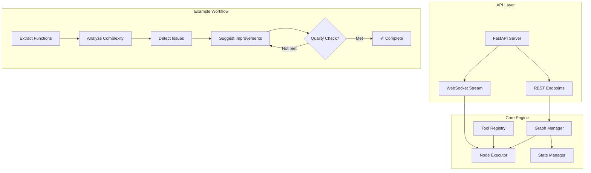

# 🚀 Workflow Engine AI Assignment

<div align="center">


*A simplified workflow/graph engine similar to LangGraph for AI agent orchestration*

[📖 Documentation](#documentation) • [🚀 Quick Start](#quick-start) • [🔧 API Reference](#api-reference) • [📊 Examples](#examples)

</div>

---

## 📋 **Project Overview**

### 🎯 **Assignment Challenge**
Build a lightweight workflow engine that enables:
- **Graph-based workflows** with nodes and edges
- **Shared state management** between processing steps
- **Conditional branching & looping** logic
- **REST API interface** for remote execution
- **One practical example** demonstrating all capabilities

### 🏆 **Our Implementation**
We built **Option A: Code Review Mini-Agent** - a complete workflow engine with:
- ✅ **5-node workflow** demonstrating real code analysis
- ✅ **Conditional routing** based on quality scores
- ✅ **Looping mechanism** until quality thresholds are met
- ✅ **Full REST API** with WebSocket support
- ✅ **Production-ready** architecture

---

## 🏗️ **Architecture**


# 🚀 Quick Start #
Prerequisites
Python 3.9+

# 1. Clone & Setup #
## Clone the repository
git clone <https://github.com/virendrachaudhary29/Tredence-Analytics/tree/main/workflow-engine>

cd workflow-engine

## Create virtual environment
python -m venv venv

## Activate (Windows)
venv\Scripts\activate

## Activate (Mac/Linux)
source venv/bin/activate

# 2.Install Dependencies

pip install -r requirements.txt

# 3. Start the Server
## Method A: Using run script
python run.py

## Method B: Direct command
python -m uvicorn app.main:app --reload --host 0.0.0.0 --port 8000

# 4. Verify Installation
Open browser to:

🌐 Interactive API Docs: http://localhost:8000/docs

💚 Health Check: http://localhost:8000/health

# Project structure
``` workflow-engine/
├── app/
│   ├── main.py                 # FastAPI application
│   ├── api/endpoints.py        # REST & WebSocket endpoints
│   ├── engine/
│   │   ├── graph.py           # Core workflow engine
│   │   ├── state.py           # State management
│   │   └── registry.py        # Tool/function registry
│   ├── models/schemas.py      # Pydantic data models
│   └── workflows/
│       └── code_review.py     # Example: Code Review Agent
├── requirements.txt
├── README.md
└── run.py
```
# 🔧 API Reference
``` Core Endpoints
Endpoint	Method	Description	Example
/graph/create	POST	Define new workflow	📋
/graph/run	POST	Execute workflow	▶️
/graph/state/{id}	GET	Monitor execution	👁️
/graph/tools	GET	List available tools	🛠️
/graph/graphs	GET	List workflows	📚
/graph/ws/{id}	WS	Real-time updates	⚡
```

#📊 Examples
🔄 Example Workflow: Code Review Agent

``` {
  "workflow": "Code Quality Pipeline",
  "nodes": ["extract", "analyze", "detect", "suggest", "check"],
  "logic": "Loop until quality_score >= threshold"
}
```

Execution Flow:
```
1️⃣ Extract Functions → 2️⃣ Analyze Complexity → 3️⃣ Detect Issues
                                           ↑              ↓
5️⃣ Check Quality ← 4️⃣ Suggest Improvements (loop if needed)
```
# Features Implemented
🎯 Features Implemented
 Core Requirements
```
 Feature	        Implementation
Graph Engine		    Nodes, edges, adjacency list
State Management		Pydantic models, shared dict
Tool Registry		    5+ pre-registered functions
API Endpoints		    FastAPI with auto-docs
Conditional Branching	Edge-based routing logic
Looping Support		    Quality threshold checking
```

# 📈 Performance & Scaling
Current Architecture
In-memory storage - Fast for development/demo

Synchronous execution - Simple and predictable

No external dependencies - Easy to run anywhere

Production Ready Enhancements
python
# With more time, we would add:
### 1. PostgreSQL/Redis for persistence
### 2. Celery for async task processing  
### 3. Docker containerization
### 4. Authentication & rate limiting
### 5. Prometheus metrics & monitoring

# 🤝 Contributing
Fork the repository

Create a feature branch (git checkout -b feature/AmazingFeature)

Commit changes (git commit -m 'Add AmazingFeature')

Push to branch (git push origin feature/AmazingFeature)

Open a Pull Request

# 📄 License
Distributed under the MIT License. See LICENSE file for more information.

# 👨‍💻 Author
Virendra Chaudhary

GitHub: https://github.com/virendrachaudhary29

Email: virendremoond@gmail.com

LinkedIn: https://www.linkedin.com/in/virendra-chaudhary1/